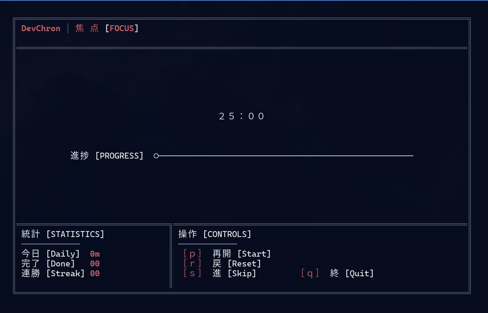
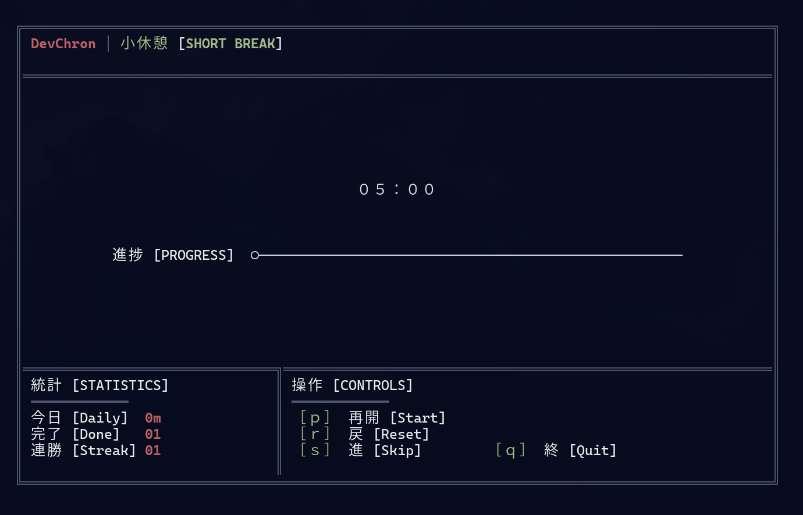
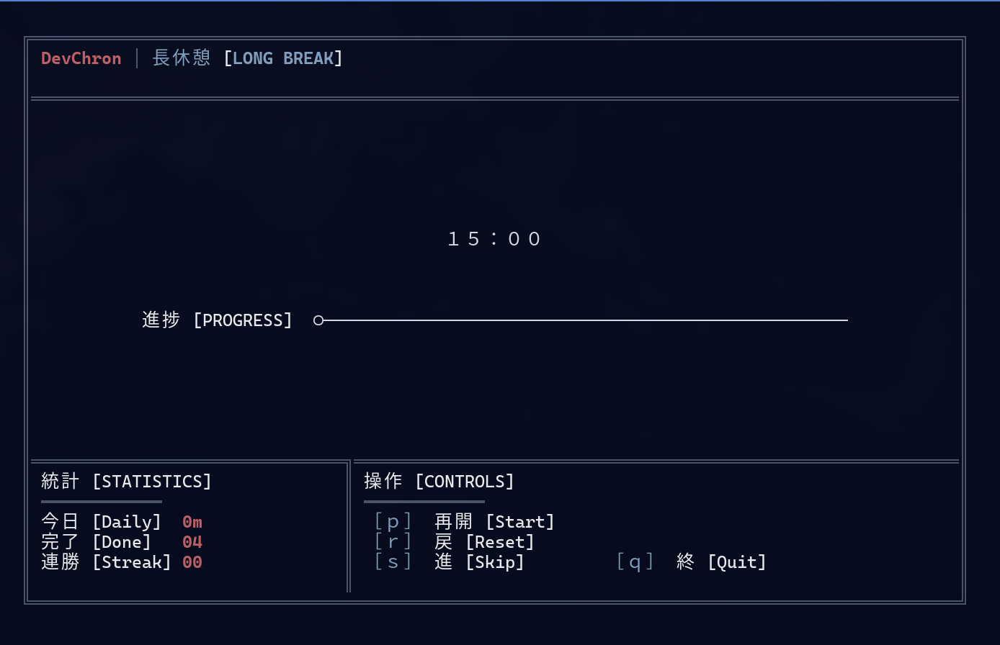

# DevChron 🍅

A stunning, lightweight TUI Pomodoro timer for Hyprland/Wayland, built with Rust and ratatui.





## Features

- 🍅 **Pomodoro Timer**: Classic 25-minute focus sessions
- ☕ **Smart Breaks**: Automatic short (5min) and long (15min) breaks
- ⚙️ **Configurable**: Customize all timer durations via TOML config
- 🎨 **Beautiful Themes**: Nord, Catppuccin, and Classic color schemes
- 🔔 **Desktop Notifications**: Get notified when each phase completes
- 📊 **Session Tracking**: Track your daily and total focus time
- ⌨️ **Keyboard Driven**: Full keyboard control with intuitive shortcuts
- 🪟 **Status Bar Integration**: JSON output for Waybar/Polybar integration
- 🌊 **Wayland Native**: Built for modern Linux compositors

## Installation

### From AUR (Arch Linux)

```bash
yay -S devchron
```

### From Source

```bash
git clone https://github.com/bhood239/DevChron.git
cd DevChron
cargo install --path .
```

### Requirements

- Rust 1.70+ (for building)
- D-Bus (for notifications)

## Usage

Simply run:

```bash
devchron
```

### Keyboard Shortcuts

| Key | Action |
|-----|--------|
| `Space` | Start/Pause timer |
| `R` | Reset current timer |
| `S` | Skip to next phase |
| `Q` / `Esc` | Quit application |
| `H` / `?` | Toggle help screen |

## Configuration

DevChron reads its configuration from `~/.config/devchron/config.toml`. A default config is created on first run.

```toml
[timer]
focus_duration = 25        # minutes
short_break_duration = 5   # minutes
long_break_duration = 15   # minutes
cycles_before_long_break = 4

[notifications]
enabled = true
sound_enabled = false

[ui]
theme = "nord"  # nord, catppuccin, classic

[integrations]
hyprland_status_bar = true
```

## Waybar Integration

DevChron writes its status to `~/.cache/devchron/status.json` which can be read by status bars.

### Waybar Config

Add to your `~/.config/waybar/config`:

```json
"custom/pomodoro": {
    "exec": "jq -r '.phase + \" \" + .time_remaining' ~/.cache/devchron/status.json 2>/dev/null || echo 'inactive'",
    "interval": 1,
    "format": "🍅 {}",
    "on-click": "pkill -USR1 devchron"
}
```

### Status JSON Format

```json
{
  "phase": "focus",
  "time_remaining": "23:45",
  "session": "2/4",
  "is_running": true,
  "percentage_complete": 7
}
```

## Themes

### Nord (Default)
Calm, Nordic-inspired colors perfect for long focus sessions.

### Catppuccin Mocha
Modern pastel theme that's easy on the eyes.

### Classic Tomato
Traditional Pomodoro colors - bold and energizing.

## Building

```bash
cargo build --release
```

The binary will be at `target/release/devchron`.

## Development

```bash
# Run with debug output
RUST_LOG=debug cargo run

# Run tests
cargo test

# Check code
cargo clippy
```

## License

MIT License - see LICENSE file for details

## Acknowledgments

- Built with [ratatui](https://github.com/ratatui-org/ratatui) - Terminal UI framework
- Inspired by the Pomodoro Technique by Francesco Cirillo
- Color schemes from [Nord](https://www.nordtheme.com/) and [Catppuccin](https://github.com/catppuccin/catppuccin)

## Contributing

Contributions welcome! Please open an issue or PR.

## Roadmap

- [ ] Sound alerts with custom sounds
- [ ] Session history and statistics export
- [ ] Multiple timer profiles
- [ ] Task/project tracking integration
- [ ] Web dashboard (optional)
- [ ] Auto-pause on system idle

---

Made with ❤️ for developers that like their focus time
